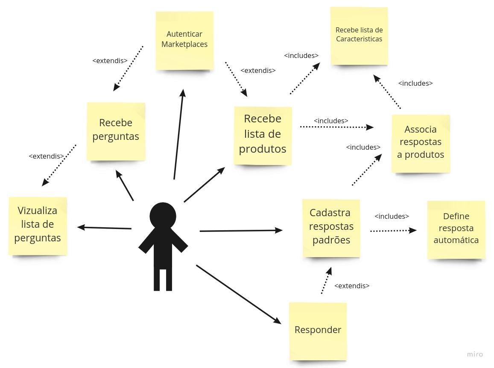
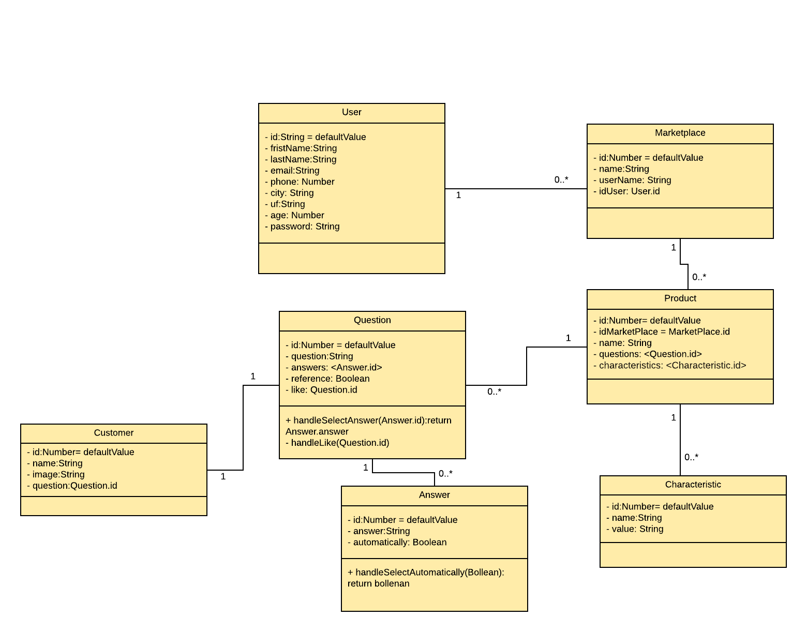

<h2>Casos de uso</h2>

  O usuário no uso da ferramenta poderá:
  <ul>
    <li>
    Receber perguntas dos seus clientes interessados nos seus produtos nos marketplaces.
    </li>
    <li>Responder às perguntas</li>
    <li>Criar perguntas referenciais e anexar respostas padrões a elas</li>
    <li>Automatizar respostas</li>
    <li>Visualizar respostas respondidas</li>
    <li>Visualizar uma lista dos seus produtos</li>
    <li>Associar perguntas de referência as produtos</li>
    <li>Visualizar lista de características de seusn produtos</li>
    <li>Autenticar-se em marketplaces</li>

<h2>Diagrama de entidades</h2>

  O banco de dados se constituira em 8 tabelas, sendo elas <i>user, marketplace, product, characteristics, value, question, answer e costumer</i>.

<h2>Diagrama de Classes</h2>

   A ferramenta será contruida em cima de 7 models, sendo elas <i>user, marketplace, product, characteristics, question, answer e costumer</i>

