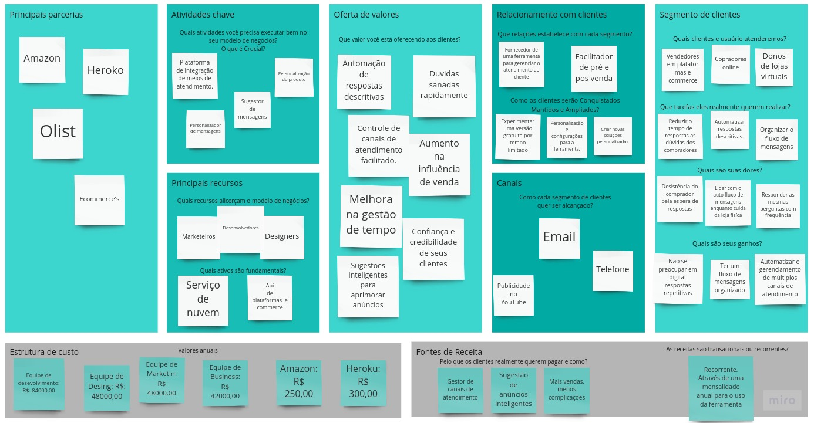

<h1>Modelo de Negócios<h1>

<h3>Segmento de Clientes</h3>

> Os clientes em suma maioria serão vendedores onlines, principalmente aqueles que tem lojas espalhadas pelos marketplaces como Amazon, Mercado Livre, Americanas entre outros. Onde quais enfrentam grande desafio em coordenar suas lojas e responder dezenas de clientes todos os dias e quando não o fazem acabam perdendo a venda.
> Com o uso de nossa ferramenta ele poderá garantir que seus clientes obtenham suas respostas sem que precise para de gerenciar suas lojas.

<h3>Relacionamento</h3>

> Forneceremos a ferramenta de gestão de atendimento para que os lojistas virtuais possam agilizar ou automatizar o atendimento ao cliente. A ideia é fornecer uma experiência de 30 dias para que o cliente possa se familiarizar com essa solução. Após isso se optar por prosseguir com a solução poderá obter auxílio com a ferramenta e personalização.

<h3>Canais</h3>

> A equipe alcançara nossos clientes através de mídias sociais, e-mail, telefone e futuramente de maneira orgânica.

<h3>Estrutura de custos</h3>

> Os clientes estarão investindo nessa solução de aceleração ao atendimento ao cliente por meio de planos mensais ou anuais.

<h3>Oferta de Valores</h3>

> Com a aceleração ao tempo de respostas as dúvidas de seus clientes, os lojistas terão um acréscimo as vendas, terão mais tempo para o gerenciamento de suas lojas e o aumento da confiança e credibilidade de seus clientes.

<h3>Atividades Chaves</h3>

> A integração com as Api's de marketplaces garantirão o recebimento de todas as mensagens, que serão tradas automaticamente ou se o lojista preferir conferir o trambalho da ferramenta escolherá entre alternativas de respostas pré programadas.

<h3>Principais recursos</h3>

> Para o perfeito funcionamento da ferramenta contamos com nossa equipe de marketing, designers, gestores e desenvolvedores. Além de serviços de nuvem para hospedagem da ferramenta.

<h3>Parcerias</h3>

> Para a hospedagem da ferramenta contaremos com o Heroko para o back e Amazon para o front. Marketplace para integração com api e futuramente Olist alcançando os maiores marketplaces.

<h3>Estrutura de custos</h3>

> Os custos estão dividido entre salários e hospedagem da ferramenta.
