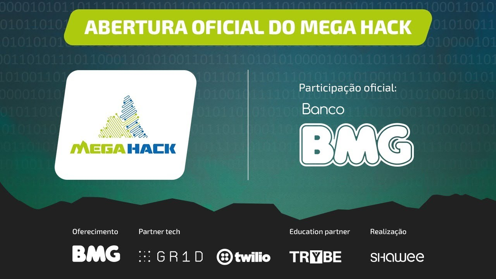

<h1>Equipe de Hackathon</h1>

<h2>Time de desenvolvedores</h2>

<h2>Tadeu Agostini <i>Business</i>&<i>FullStack</i></h3>
<a href="https://www.linkedin.com/in/tadeu-agostini-498826147/">Linkedin</a> 
<a href="https://github.com/TadeuA">GitHub</a>

<h3>Henrique Gomes <i>UI/UX</i></h3>
<a href= "https://www.linkedin.com/in/henriquegomess/">Linkedin</a> 
<a href="https://github.com/Henriquegomess">GitHub</a>

<h3>Émerson Alves Beier <i>Marketing</i></h3>
<a href="https://www.linkedin.com/in/%C3%A9merson-alves-beier-850364138/">Linkedin</a> 
<a href="https://github.com/EAbeier">GitHub</a>

<h3>Carlos Finelli <i>Developed</i></h3>
<a href="https://www.linkedin.com/in/carlosfinelli/">Linkedin</a> 
<a href="https://github.com/CarlosFinelli">GitHub</a>

<h2>Desafio Olist</h2>

> O Olist é a maior vitrine de produtos em marketplaces no brasil inteiro, tendo nesta vitrine mais >de 1 milhão de produtos diferentes anunciados, com mais de 400 mil vendas por mês. Empoderando o E Commerce brasileiro, ajudando comerciantes locais de pequenos, médios e grande portes a ter mais visibilidades e janelas de vendas distribuídas. Além de toda a gestão logística de envios desses produtos, além de todo o fluxo de repasse financeiro.
>
> Desafios
>
> O segmento de comércio online é muito dinâmico e robusto. O volume em número de pedidos passam de 120 milhões em 2019. O grande volume do pedido consequentemente gera um volume gigantesco de >dúvidas e questionamentos nos itens em questão.
>
> Esse grande fluxo de perguntas em diversos sites de marketplace, prejudica não só a experiência >do usuário, mas atrapalha a logística do vendedor, gerando um ruído em sua comunicação e >consequentemente perda de vendas.
>
> Porém segundo os próprios vendedores, são questionamentos relativamente simples, como: "ainda >está disponível", "qual a cor", "tem a cor preta", "qual prazo de entrega", muitas dessas >perguntas, estão descritas na própria descrição do anúncio, ou são passíveis de automatização.
>
> Por exemplo, perguntas como "ainda está disponível", "qual a cor", "tem a cor preta", "qual >prazo de entrega", muitas dessas perguntas, estão descritas na própria descrição do anúncio, ou >são passíveis de automatização
>
> Em apenas um canal de venda, recebemos em média mais de 200 mil perguntas por mês.
> Sabendo disso, como podemos resolver os seguintes desafios:
> Melhorar a experiência de consumo a informação do produto;
> Facilitar a tomada de decisão na hora da compra;
> Proporcionar ao vendedor uma gestão mais fluída e otimizada;.

<h2>Prolema atacado</h2>

> Os vendedores onlines em suma maioria são microempreendedores ou MEI e
> tomam conta de suas lojas sozinhos ou com ajuda d' afamilia. E cabe a eles
> gerenciar seus estoques, anunciar seus produtos, atender seus clientes e entregar
> seus produtos. Isso deixa qualquer um sobre carregado, e quando se trata em
> atender clientes, isso significa fazer o pré e o pós venda. Que atualmente acontece
> através de chats e e-mails, onde o volume desses não gigantescos e muitas desses
> contatos são para esclarecer dúvidas, que se repetem bizarramente. Causando um
> desgaste nos vendedores que por sua vez devido à exaustão de todo seu processo
> de trabalho podem deixar de lado o esclarecimento dessas dúvidas, assim deixando
> de fazer algumas vendas.

<h2>A Solução</h2>

> Não encontramos algo parecido, A nossa ferramenta é exclusivamente para
> responder perguntas feitas nos marketplaces, onde as reúnem em um único feed. E
> mais, ela permitirá que o vendedor possa cadastrar perguntas e definir opções de
> respostas e se preferir **automatizá-las**. E quando houver uma nova pergunta a
> ferramenta avisará sobre o ocorrido então basta o vendedor selecionar uma das
> opções de resposta, sem precisar perder tempo digitando toda vez ou se optou por automatizá-la **a ferramenta** toma iniciativa e a **responde** da melhor forma

<h2>O Hackathon</h2>

> O maior hackathon on-line do Brasil.
>
> O **Mega Hack** é o Monte Everest dos hackathons.
>
> Essa 2ª edição, conta com o apoio empresas que acreditam no poder de transformação do hackathon, >e colabora com o desenvolvimento de novos conhecimentos, permitindo que as pessoas ao redor do >mundo criem cada vez mais novas conexões. Tais como:

